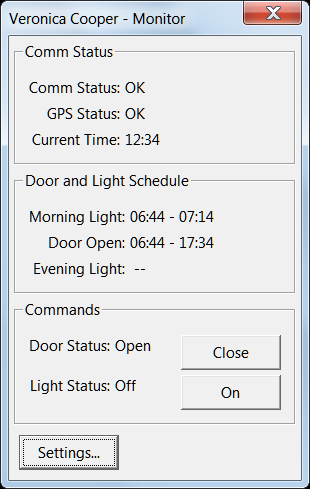
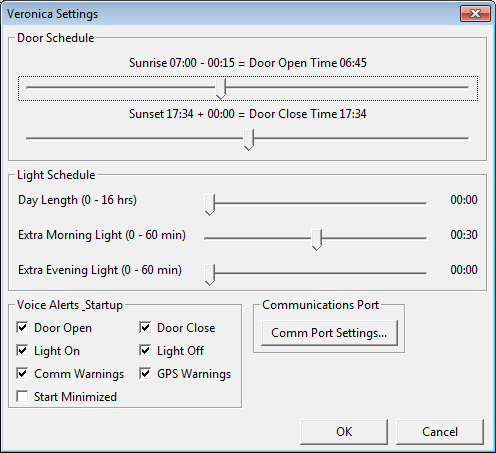

# wxVeronica
A wxWidgets program to monitor and configure the Gary Cooper chicken coop controller.

The description says it all. This program monitors the telemetry data sent, via radio datalink from the Gary Cooper Arduino chicken coop controller, and provides voice updates whenever the coop door automatically opens or closes. It also provides the opportunity to change the settings as the current Gary Cooper implementation has no physical user interface. This program builds on both Linux and Windoze, so use your preferred platform. Code::Blocks projects are provided for both. With regard to windoze, I have not built the project with VisualC++ as I use the MinGW compiler that is installed with Code::Blocks.

NOTE: This program will not build on it's own. It is completely dependent on the GaryCooper project. In order to build this program you will need to install and configure wxWidgets, and Code::Blocks. A proper directory structure will have a base directory with the GaryCooper and wxVeronica directories below it. The wxVeronica code (this project) uses relative paths to include important shared files from the GaryCooper chicken coop controller project. For more info on building wxWidgets see:
http://wxwidgets.org/
and
https://wiki.wxwidgets.org/Compiling_wxWidgets_with_MinGW

# Screen Shots

  
  

